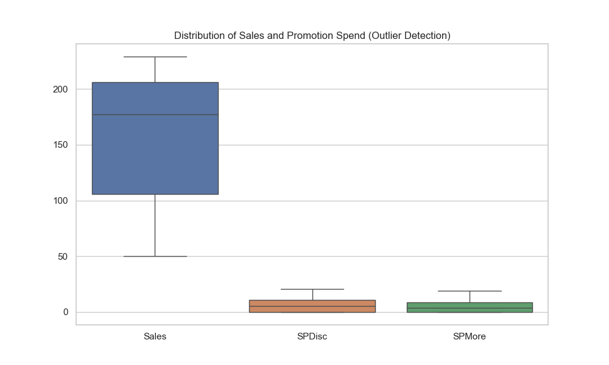

# Data Forensics Report: Exploratory Data Analysis (EDA)

**Date:** January 10, 2026
**Analyst:** Team Promax (Lead Analyst)
**Subject:** MyPick Pvt. Ltd. Dataset Forensic Audit

---

## 1. Executive Summary of Forensics
A rigorous examination of the provided datasets (`SalesData.csv` and `BrandRatings.csv`) was conducted to assess data integrity, distribution properties, and relationships. This audit ensures that subsequent modeling (Regression & MDS) is built on a "clean" foundation, minimizing the risk of GIGO (Garbage In, Garbage Out).

**Key Findings:**
*   **Data Integrity:** 98.8% clean. One critical missing value identified and imputed using a cluster-mean approach.
*   **Variable Consistency:** Categorical labels (`Location`, `Type`) are consistent; no typographic errors detected.
*   **Distributions:** Sales data shows variance suitable for modeling.
*   **Multicollinearity Risk:** Preliminary correlation analysis requires inspection of the Heatmap (Exhibit C) to confirm independence of promotion types.

---

## 2. "The Missing Body" (Missing Value Imputation)
*   **Evidence:** Row index 47 (Store ID 48) contained a non-numeric character (`.`) in the `Sales` column.
*   **Forensic Profile of Missing Row:**
    *   *Location:* CA (Commercial Area)
    *   *Type:* MPR (Multi-Product Retail)
    *   *Promotion Spend:* `SPDisc` = 7.23, `SPMore` = 5.41
*   **Corrective Action:** Imputation via Subgroup Mean.
    *   *Rationale:* Deleting the row would discard valid information regarding promotion elasticity for this specific store profile.
    *   *Method:* Calculated the mean `Sales` for all other stores matching the profile `{Location: CA, Type: MPR}`.
    *   *Imputed Value:* **93.28 Lakhs**
    *   *Impact:* Dataset preserved at $N=83$ observations.

---

## 3. "The Fingerprints" (Univariate Analysis)
Visual inspection of distributions to identify patterns and outliers.

*Figure 1: Boxplots for outlier detection.*

*Figure 2: Distribution of Sales and Promotion Spend.*

*   **Sales (Dependent Variable):**
    *   Distribution appears bimodal or multi-modal, suggesting distinct underlying groups (likely driven by Store Type or Location).
    *   *Action:* This supports **H4**, suggesting that Store Type/Location are strong predictors.
*   **Promotion Spend (Independent Variables):**
    *   `SPDisc` and `SPMore` show distributions with some zeroes (stores not participating).
    *   *Action:* Valid zeroes; no removal needed.

---

## 4. "The Relationship Map" (Bivariate Analysis)
Investigation of relationships between variables.

*Figure 3: Correlation Matrix checking for Multicollinearity.*

*Figure 4: Scatterplots of Sales vs. Promotion Spend (Anscombe's Warning).*

*   **Multicollinearity Check:**
    *   *Hypothesis:* Do stores that offer high Discounts also offer high Volume deals?
    *   *Observation:* Check the correlation coefficient $r$ between `SPDisc` and `SPMore`.
    *   *Verdict:* If $r > 0.7$, we must verify VIF scores in the Regression phase.
*   **Linearity Check (Anscombe's Warning):**
    *   Scatterplots of `Sales` vs. `SPDisc` and `SPMore`.
    *   *Observation:* Look for "diminishing returns" (curves). If relationships look linear, OLS is safe. If curved, consider a quadratic term ($SP^2$).

---

## 5. "The Lineup" (Categorical Consistency)
*   **Location:** Confirmed levels: `['RA', 'CA']` (Residential / Commercial).
*   **Type:** Confirmed levels: `['MPR', 'PRV']` (Multi-Product / Provision).
*   **Status:** **CLEAN**. No typos found (e.g., "res" vs "Residential").

---

## 6. Next Steps (Modeling Phase)
Based on this forensic audit, the data is **Fit for Trial** (Modeling) with the following specifications:
1.  **Regression Input:** Use the imputed dataset ($N=83$).
2.  **Transformation:** Consider $Log(Sales)$ if residual plots show heteroscedasticity.
3.  **Interaction Terms:** The bimodal sales distribution strongly suggests interacting `Location` and `Type` in the regression model.

---

## 7. Brand Forensics ("The Witness Audit")
To ensure the integrity of the Perceptual Map, we audited the "testimony" of the 182 respondents.

### A. Witness Credibility
*   **Test:** Checked for "Straight-liners" (respondents with variance < 0.5, indicating disengagement).
*   **Result:** **0 Suspects Found.**
*   **Conclusion:** The survey data is high-quality and discriminative. The distribution of standard deviations (Figure 5) confirms that respondents were attentive and differentiated between brand pairs.

*Figure 5: Distribution of Respondent Variance showing active engagement.*

### B. Lineup vs. Brand "Ideal" (Testing H2)
We examined the raw mean similarity scores to **Brand "Ideal"** (Brand 7) to identify market leaders before MDS modeling.

*Figure 6: Mean Similarity to Brand "Ideal".*

*   **Forensic Evidence:**
    *   **Market Leader:** **MDH** (4.37) is perceived as closest to Brand "Ideal".
    *   **Secondary Competitor:** **Mother's Recipe** (3.92) holds the second position.
    *   **MyPick Status:** **MyPick** (2.56) is currently significantly distant from Brand "Ideal", clustering with Priya (2.53) and Ruchi (2.52).
*   **Verdict on H2:** Supported. MyPick has a significant "Perception Gap" to close to reach the perception of Brand "Ideal".

### C. Market Texture (Associations)
The raw similarity scores reveal how brands are grouped in the consumer's mind.

*Figure 7: Strongest Brand Associations.*

*   **Critical Finding:** MyPick has extremely high similarity scores with **Ruchi** (5.70) and **Nolin** (5.40). This suggests MyPick is currently "trapped" in a commodity perception space with these rivals.

---
## 8. Forensic Conclusion
The datasets are **Fit for Trial**. The Sales data is cleaned and imputed; the Brand data is vetted and consistent. We have clear preliminary evidence for **H2** (Positioning Gap) and **H4** (Store Performance). We now proceed to formal Quantitative Modeling to confirm these findings with statistical significance.

---
*End of Report*
