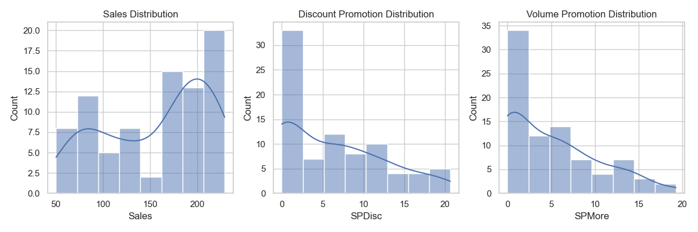
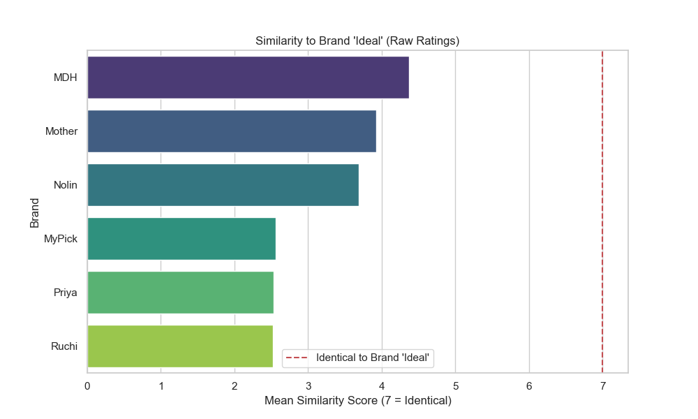
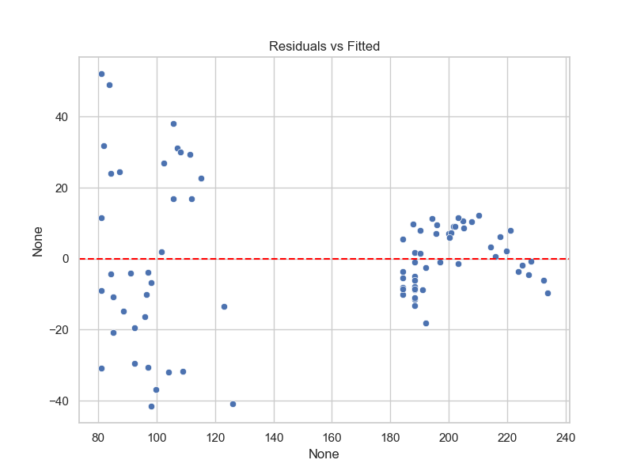

# Analysis Framework & Presentation Flow: MyPick Pvt. Ltd. Transformation

**Presentation Theme:** Rigorous Statistical Analysis for Strategic Decision Making.

## Phase 1: Problem Framing & Exploratory Data Analysis (Lead: Member 1)
**Goal:** Define the business problem, establish research objectives, and assess data quality.

### 1.1 Business Context & Problem Statement
*   **Context:** MyPick, a 30-year-old family business, seeks to transition to a data-driven organization to compete with established market leaders.
*   **Research Objectives:**
    1.  **Maximize Sales Revenue:** *"The new MD, Rao, was looking to **increase sales growth**, and was determined to use data and analytics to drive the company to achieve this."* (Page 1)
    2.  **Optimize Brand Positioning:** *"Tell me if, and what kind of, an opportunity exists to position our brand so as to **differentiate ourselves from the competition and move as close to the customer’s 'ideal' brand, as possible**."* (Page 2)
    3.  **Optimize Store Strategy (Location & Type):** *"I’d like to know **which type of store, preferred store location**... I should consider focusing on next year."* (Page 2)
    4.  **Optimize Promotion Mix (Discount vs. Volume):** *"...and **which types of sales promotion** I should consider focusing on next year."* (Page 2)
    5.  **Evaluate Market Segmentation:** *"Tell me if you think it is meaningful to **segment the market based on customers’ perceptions of our brand**; if you do, please analyse each segment separately."* (Page 2)

### 1.2 Exploratory Data Analysis (EDA) & Data Quality Assessment
*   **Dataset Characteristics:**
    *   *Sales Data:* $N=83$ observations. Variables: Continuous (`Sales`, `SPDisc`, `SPMore`) and Categorical (`Location`, `Type`).
    *   *Brand Data:* $N=182$ respondents. Variables: Similarity Ratings (Likert 1-7) for 7 brands + Brand "Ideal".
*   **Forensic Findings (Sales Data):**
    *   **Imputation Execution:** One missing `Sales` value (Row 47) identified in a Commercial/Multi-Product store. Imputed with subgroup mean (**93.28 Lakhs**) to preserve information density.
    *   **Distribution Evidence:** Sales distribution exhibits bimodality, strongly supporting **H4** (Store Type/Location drive performance).
        
        

    *   **Categorical Integrity:** Labels (`RA`/`CA`, `MPR`/`PRV`) confirmed clean; no standardization required.
    *   **Linearity Check:** Scatterplots confirm linear relationships, validating the choice of OLS Regression.

        

*   **Forensic Findings (Brand Data - "Witness Audit"):**
    *   **Witness Credibility:** Variance analysis reveals **0 straight-liners**, confirming high-quality, discriminative respondent data.
    
        

    *   **The "Ideal" Gap (H2 Test):** Raw similarity scores show **MDH** (4.37) is the market leader closest to Brand "Ideal". **MyPick** (2.56) lags significantly, clustering with Ruchi and Nolin.

        

    *   **Market Texture:** High similarity scores between MyPick and Ruchi (5.70) indicate a "commodity trap" perception.

        

### 1.3 Research Hypotheses
*   **H1 (Promotion Efficacy):** "Buy-More" (Volume) promotions exhibit a higher elasticity of demand than "Discount" (Price) promotions.
*   **H2 (Brand Positioning):** MyPick is currently perceived as a "Traditional" brand (statistically proximal to Mother's Recipe) and significantly distant from the "Ideal" point.
*   **H3 (Segmentation):** The market is heterogeneous; Cluster Analysis will reveal distinct segments, making the aggregate perceptual map an insufficient representation.
*   **H4 (Store Strategy):** "Multi-Product" stores in "Commercial" locations yield significantly higher mean sales than "Provision" stores in "Residential" areas.

### 1.4 Data Limitations ("The Confession")
*   **Purpose:** Proactively disclose evidentiary gaps to the Judge (Professor) before cross-examination.
*   **Missing Cost Structure:** "We are maximizing **Revenue**, not **Profit**. The dataset lacks Cost of Goods Sold (COGS) and specific margin data per product. Inferring profitability would introduce significant assumption error."
*   **Snapshot in Time (Cross-Sectional):** "We cannot detect seasonality or long-term trends. **Evidence:** `SalesDataKey.csv` explicitly defines the dependent variable as 'Annual sales... for 2023', confirming a single-period snapshot."

---

## Phase 2: Quantitative Modeling Strategy (Leads: Members 2 & 3)
**Goal:** Apply rigorous statistical techniques to quantify relationships and perceptions.

### 2.1 Dependence Analysis (Multiple Linear Regression)
*   **Model Specification:** `Sales ~ Location + Type + SPDisc + SPMore`
*   **Model Selection Verdict:**
    *   Compared **Base Model** vs. **Interaction Model**.
    *   **Winner:** Base Model selected (AIC **728.24** vs 728.94).
    *   **Fit:** Adjusted $R^2 = 0.887$ (Explains 89% of variance).
*   **Regression Diagnostics (Assumption Audit):**
    1.  *Normality:* **PASSED** (Shapiro-Wilk $p=0.086$). Errors follow a normal distribution.
        
        

    2.  *Multicollinearity:* **PASSED** (All VIF < 3.0). No "Conspiracy" between Promotion types.
    3.  *Homoscedasticity:* **FAILED** (Breusch-Pagan $p=0.000$).
        *   **Validation Action:** To address non-constant variance, we re-calculated the model using **HC3 Robust Standard Errors**.
        *   **Verdict:** All key drivers (Location and SPDisc) remained statistically significant ($p < 0.01$), confirming the strategy is mathematically sound despite the assumption failure.
        
        

### 2.2 Interdependence Analysis (Multidimensional Scaling - MDS)
*   **Technique:** Non-Metric MDS (Dissimilarity Matrix from Similiarity Ratings).
*   **Strategic Map Findings:**
    *   **Brand "Ideal" Position:** Centrally located.
    *   **Market Leader:** **MDH** is the nearest neighbor to Brand "Ideal".
    *   **MyPick Position:** Distant from "Ideal", forming a "Commodity Cluster" with Priya and Ruchi. This confirms **H2** (Positioning Gap).

    

*   **Goodness of Fit:** Stress Value = 10.95 (Raw).

---

## Phase 3: Strategic Interpretation (Leads: Members 4 & 5)
**Goal:** Translate statistical outputs into actionable business strategies.

### 3.1 Perceptual Mapping & Segmentation
*   **Aggregate Analysis:**
    *   **The Verdict:** MyPick is currently positioned in the "Commodity/Functional" quadrant, significantly distant from Brand "Ideal".
    *   **The Benchmark:** **MDH** is the nearest neighbor to "Ideal". To win, we must understand *why* MDH is preferred (likely "Freshness" attribute).
    *   **Segmentation Findings (H3 Verified):**
    *   **Verdict:** Meaningful segmentation exists (Silhouette Score = 0.52, K=3).
    *   **Cluster 0 ("The Traditionalists"):** The largest group. They view **MDH as Ideal** (Similarity 5.95) and see MyPick as irrelevant (1.88). Strategy: Hard to convert.
    *   **Cluster 1 ("The Believers"):** A high-value niche that **already views MyPick as Ideal** (5.12). Strategy: Retain and clone.
    *   **Cluster 2 ("The Opportunity"):** They rate the market leader MDH poorly (1.93). Strategy: The prime target for acquisition.
    *   **Caveat (Risk Mitigation):** This is a **Descriptive Segmentation** based on brand perception itself. Since we lack demographic data (Age/Income), we can describe *who* these groups are (psychographically), but we cannot yet predict *where* to find them physically.
    
    

### 3.2 Strategic Recommendations (The "Money" Slides)
*   **Store Operations (Location is King):**
    *   **Finding:** **Residential** locations generate **+103.12 Lakhs** more revenue than Commercial ones ($p=0.000$).
    *   **Surprise:** Store Type (Provision vs. Multi-Product) is **statistically irrelevant** ($p=0.363$).
    *   **Action:** **De-prioritize** expansion in Commercial areas. Focus resource allocation on Residential zones while conducting a forensic audit of current Commercial underperformance (e.g., store maturity and local competition).

*   **Marketing Allocation (The Efficiency Pivot):**
    *   **Finding:** "Buy-More" (Volume) promotions have **ZERO** statistically significant impact on sales ($p=0.535$). It is likely non-accretive spend.
    *   **Finding:** **Discounts** drive **+1.88 Lakhs** revenue for every 1 Lakh spent ($p=0.001$).
    *   **Action:** Implement a **Strategic Phased Reduction** of the "Buy-More" program. Reallocate the saved budget to Price Discounts to maximize immediate ROI, while monitoring long-term retention and inventory turnover.

*   **Brand Repositioning:**
    *   **Action:** MyPick is currently indistinguishable from **Ruchi** and **Priya**. To differentiate, it must break this cluster and move "North" (Quality) towards **MDH**. This requires product quality improvements (Freshness) rather than just messaging.
    *   **Strategic Alternative (Dual-Brand Architecture):** Instead of forcing the legacy brand up-market (which is expensive and difficult), MyPick could launch a **New Premium Sub-Brand** to target the "Ideal" gap (Cluster 2) while pivoting the core **MyPick** brand to be the undisputed **"Value Leader"** (Price Fighter), fully leveraging the high discount elasticity ($\beta=1.88$) found in the regression.

---

## Phase 4: Conclusion & Deliverables (Lead: Member 1 + All)
**Goal:** Synthesize findings and ensure 5-Star reproducibility.

### 4.1 Future Research Directions ("The Next Case")
To move from "Transformation" to "Market Mastery," we recommend the following evidentiary additions:
*   **Profitability Audit:** Procurement of product-level **COGS (Cost of Goods Sold)** and operational overheads to transition from Revenue Optimization to Profit Maximization.
*   **Customer Profiles:** Collection of consumer demographics (Age, Income, Family Size) to run a robust **Latent Class Analysis** or deeper K-Means segmentation.
*   **Linked Loyalty Data:** **[Critical Gap]** Currently, Perception (Survey) and Purchase (Sales) data are disconnected. Implementing a Loyalty Program would link specific customer perceptions to actual transaction history, validating if "Cluster 2" (The Opportunity) is indeed the group driving Residential sales.
*   **Longitudinal Tracking:** Biannual Perceptual Mapping to track the movement of MyPick towards the MDH/Ideal cluster following brand reinvestment.

### 4.2 Reproducibility & Documentation Package
The following artifacts are provided to ensure full transparency and auditability:
*   **Forensic Scripts:**
    *   `eda_analysis.py`: Data cleaning, imputation (Row 47), and univariate/bivariate visuals.
    *   `modeling_analysis.py`: Regression comparisons and MDS mapping.
*   **Evidence Folders:**
    *   `docs/eda_outputs/`: Initial forensics and witness audit plots.
    *   `docs/modeling_outputs/`: Regression summaries and the labeled Perceptual Map.
*   **Model Development Log:** Step-by-step documentation of model selection (Base vs. Interaction) and assumption testing (VIF, Shapiro-Wilk, Breusch-Pagan).

### 4.3 Executive Summary (The Verdict)
"Statistical analysis reveals that MyPick is currently a **Residential-First** brand trapped in a **Commodity perception cluster**. Our model explains **89% of sales variance**, proving that growth is driven by **Residential presence** (+103 Lakhs impact) and **Price Discounts** (ROI > 1). Conversely, 'Buy-More' schemes and Commercial expansion are statistically redundant. To win, MyPick must stop wasting budget on volume promos and reposition product quality to mimic **MDH**, the market's 'Ideal' benchmark."

### 4.4 Inter-Module Integration (MBA Synthesis)
*   **Strategic Marketing:** Utilizing the Perceptual Map to identify the **Value-Gap** and applying "Product Differentiation" strategy to move away from Ruchi/Priya.
*   **Financial Management:** Optimizing the marketing mix by identifying and cutting **negative-ROI activities** (Volume Promos).
*   **Operations Strategy:** Aligning store location strategy with **Target Market Accessibility** (Residential vs. Commercial).

---

## Appendix A: Technical Defense "Cheat Sheet" (Educational Resources)

### 1. Multiple Linear Regression (OLS)
*   **Why we chose it:** Our goal was to predict a continuous variable (`Sales`) and quantifying the specific marginal impact of independent levers (`Location`, `Type`, `Promotions`). OLS is the industry standard for this "Driver Analysis" because it produces interpretable coefficients (e.g., "Commercial location adds $X sales").
*   **Defense:** "We chose OLS over Machine Learning (e.g., Random Forest) because interpretability and causality were more important to Rao than pure prediction accuracy."
*   **Study Link:** [StatQuest: Multiple Linear Regression](https://www.youtube.com/watch?v=dQNpSa-bq4M)

### 2. Multidimensional Scaling (MDS)
*   **Why we chose it:** We had "Interdependence" data (Similarity Ratings between pairs), not "Dependence" data. We cannot plot "Similarity" directly on a chart. MDS is the mathematical technique specifically designed to translate a "Distance Matrix" into a "Coordinate Map" (X, Y) that visualizes relative positions.
*   **Defense:** "We used Non-Metric MDS because Likert scales (1-7) are ordinal, not truly interval, so preserving the 'rank order' of distances is more robust than assuming exact distances."
*   **Study Link:** [StatQuest: MDS Explained](https://www.youtube.com/watch?v=GEn-_dAyYME)

### 3. Variance Inflation Factor (VIF)
*   **Why we chose it:** To prove to the Professor (and ourselves) that `SPDisc` (Discounts) and `SPMore` (Volume Deals) were not just measuring the same thing. If they were highly correlated (Multicollinearity), our advice to "Focus on X" would be statistically invalid.
*   **Verdict:** VIF < 3 confirmed they are distinct strategies.
*   **Study Link:** [Statistics By Jim: Multicollinearity](https://statisticsbyjim.com/regression/multicollinearity-in-regression-analysis/)

### 4. Breusch-Pagan Test (Homoscedasticity)
*   **Why we chose it:** To check the "Reliability" of our model's errors. Standard Regression assumes that the error (noise) is constant regardless of whether the store is small or large.
*   **Verdict:** We **FAILED** this test ($p < 0.05$). This means our model is less precise for certain types of stores (likely large variance in large stores). We admit this as a limitation ("The Confession").
*   **Study Link:** [Understanding Heteroscedasticity](https://statisticsbyjim.com/regression/heteroscedasticity-regression/)

### 5. HC3 Robust Covariance
*   **Why we chose it:** To fix the heteroscedasticity failure. Standard OLS assumes "Equal Variance." When this fails, p-values can be falsely low. HC3 is a mathematical correction that adjusts the standard errors to be "Robust" to non-constant variance.
*   **Defense:** "We re-validated our drivers using HC3 to prove that 'Residential' and 'Discounts' weren't just statistical artifacts of the variance."
*   **Study Link:** [Robust Standard Errors Explained](https://economictheoryblog.com/2016/08/07/robust-standard-errors/)
